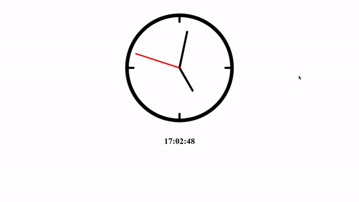

     
    
     

 

# Analogic clock

 

This is an analog clock made in Javascript. It uses the "Date" object to obtain the current time and the "canvas" tool to draw the clock. In addition, some math calcs was needed to calc the position of the clock pointers.

 

